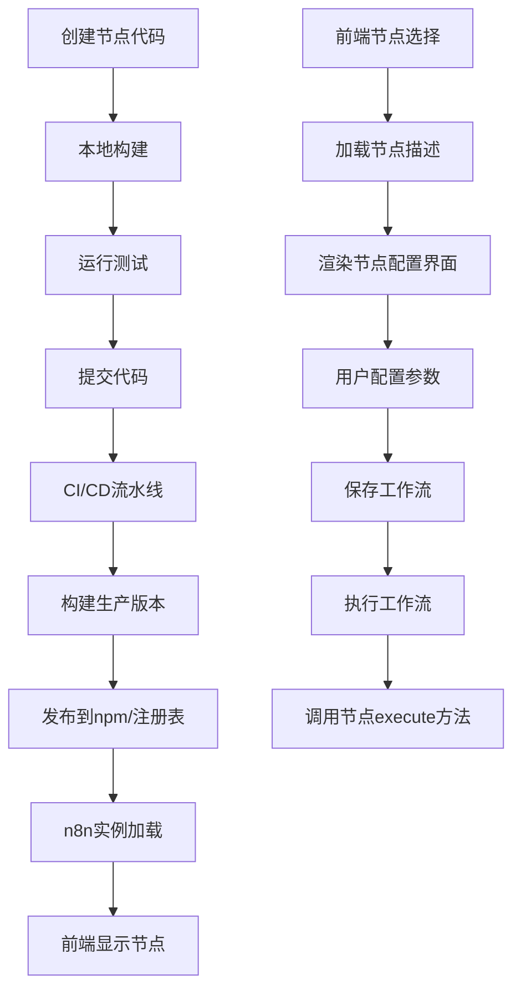

# 在n8n中新增内置节点的完整工作流程与实现方案

## 一、n8n节点架构与加载机制深度解析

### 1.1 节点架构核心原理

n8n采用了一种高度模块化的节点架构，每个节点都是独立的TypeScript类，实现了特定的接口。这种设计的核心思想是**关注点分离**和**可扩展性**。

从源码分析可以看出，n8n节点主要分为两类：
- **普通节点**：实现[`INodeType`](packages/nodes-base/nodes/DateTime/V2/DateTimeV2.node.ts:21)接口
- **版本化节点**：继承[`VersionedNodeType`](packages/nodes-base/nodes/HttpRequest/HttpRequest.node.ts:8)类，支持多版本共存

版本化节点是n8n的推荐模式，它允许在不破坏现有工作流的情况下更新节点功能。例如，[`HttpRequest`](packages/nodes-base/nodes/HttpRequest/HttpRequest.node.ts:8)节点同时支持多个版本(1.0, 2.0, 3.0, 4.0等)，每个版本可能有不同的参数和功能。

### 1.2 节点加载机制

n8n的节点加载流程由[`LoadNodesAndCredentials`](packages/cli/src/load-nodes-and-credentials.ts:37)类管理，整个过程如下：


这个加载机制的关键在于：
1. **包扫描**：系统会自动扫描符合`n8n-nodes-*`命名模式的包
2. **动态注册**：每个包通过[`DirectoryLoader`](packages/cli/src/load-nodes-and-credentials.ts:413)加载器动态注册节点
3. **后处理**：加载完成后，系统会注入额外的功能，如AI工具支持

## 二、新增内置节点的标准工作流程

### 2.1 准备阶段

1. **环境设置**
   ```bash
   # 确保在n8n项目根目录
   cd /path/to/n8n
   
   # 安装依赖
   pnpm install
   ```

2. **创建节点目录**
   ```bash
   # 在packages/nodes-base/nodes下创建新节点目录
   mkdir packages/nodes-base/nodes/MyNode
   ```

### 2.2 节点实现步骤

#### 步骤1：创建节点描述文件

创建[`MyNode.node.json`](packages/nodes-base/nodes/DateTime/DateTime.node.json:1)文件，包含节点元数据：

```json
{
  "node": "n8n-nodes-base.myNode",
  "nodeVersion": "1.0",
  "codexVersion": "1.0",
  "categories": ["Core Nodes"],
  "resources": {
    "primaryDocumentation": [
      {
        "url": "https://docs.n8n.io/integrations/builtin/core-nodes/n8n-nodes-base.mynode/"
      }
    ]
  },
  "subcategories": {
    "Core Nodes": ["Data Transformation"]
  }
}
```

#### 步骤2：实现节点主类

创建[`MyNode.node.ts`](packages/nodes-base/nodes/DateTime/DateTime.node.ts:7)文件：

```typescript
import type { INodeTypeBaseDescription, IVersionedNodeType } from 'n8n-workflow';
import { VersionedNodeType } from 'n8n-workflow';

import { MyNodeV1 } from './V1/MyNodeV1.node';

export class MyNode extends VersionedNodeType {
  constructor() {
    const baseDescription: INodeTypeBaseDescription = {
      displayName: 'My Node',
      name: 'myNode',
      icon: 'fa:star',
      group: ['transform'],
      defaultVersion: 1,
      description: 'My custom node for data processing',
      subtitle: '={{$parameter["operation"]}}',
    };

    const nodeVersions: IVersionedNodeType['nodeVersions'] = {
      1: new MyNodeV1(baseDescription),
    };

    super(nodeVersions, baseDescription);
  }
}
```

#### 步骤3：实现节点具体版本

创建`V1/MyNodeV1.node.ts`文件：

```typescript
import type {
  IExecuteFunctions,
  INodeExecutionData,
  INodeType,
  INodeTypeDescription,
} from 'n8n-workflow';

export class MyNodeV1 implements INodeType {
  description: INodeTypeDescription;

  constructor(baseDescription: INodeTypeBaseDescription) {
    this.description = {
      ...baseDescription,
      version: 1,
      defaults: {
        name: 'My Node',
        color: '#408000',
      },
      inputs: ['main'],
      outputs: ['main'],
      properties: [
        {
          displayName: 'Operation',
          name: 'operation',
          type: 'options',
          options: [
            {
              name: 'Process Data',
              value: 'processData',
            },
            {
              name: 'Transform Data',
              value: 'transformData',
            },
          ],
          default: 'processData',
        },
        // 添加更多属性...
      ],
    };
  }

  async execute(this: IExecuteFunctions): Promise<INodeExecutionData[][]> {
    const items = this.getInputData();
    const operation = this.getNodeParameter('operation', 0);
    
    // 实现节点逻辑...
    
    return [items];
  }
}
```

### 2.3 注册节点

在[`package.json`](packages/nodes-base/package.json:412)的`n8n.nodes`数组中添加新节点：

```json
"n8n": {
  "nodes": [
    // ...现有节点...
    "dist/nodes/MyNode/MyNode.node.js"
  ]
}
```

### 2.4 构建与测试

```bash
# 构建项目
pnpm build

# 运行测试
pnpm test

# 启动开发服务器
pnpm dev
```

## 三、多种实现方式对比分析

### 3.1 方式一：手动创建（标准方式）

**优点**：
- 完全控制节点结构和实现
- 深入理解n8n架构
- 适合复杂节点开发

**缺点**：
- 工作量大，容易出错
- 需要熟悉n8n内部结构
- 开发速度较慢

**适用场景**：需要高度定制化或复杂功能的节点

### 3.2 方式二：使用n8n-node-dev工具

n8n提供了专门的节点开发工具，可以通过[`packages/node-dev/commands/new.ts`](packages/node-dev/commands/new.ts:13)中的命令快速生成节点模板：

```bash
# 安装n8n-node-dev
pnpm add -g n8n-node-dev

# 创建新节点
n8n-node-dev new
```

**优点**：
- 快速生成标准节点结构
- 减少样板代码编写
- 遵循n8n最佳实践

**缺点**：
- 定制化程度有限
- 生成的模板可能需要大量修改
- 依赖工具更新

**适用场景**：标准节点开发，快速原型验证

### 3.3 方式三：复制现有节点并修改

**优点**：
- 基于已验证的代码
- 保持一致性
- 开发速度快

**缺点**：
- 可能包含不需要的代码
- 容易遗漏修改点
- 不利于理解架构

**适用场景**：开发与现有节点功能相似的节点

### 3.4 方式四：社区节点包开发

开发独立的npm包，然后安装到n8n中：

**优点**：
- 独立版本管理
- 可以分享给社区
- 不影响核心代码

**缺点**：
- 需要额外的包管理
- 集成复杂度较高
- 调试更困难

**适用场景**：开源贡献或商业节点开发

## 四、设计模式与最佳实践

### 4.1 版本化节点模式

n8n采用版本化节点模式，这是**策略模式**和**工厂模式**的结合：

```typescript
// 策略模式：每个版本是一个策略
export class MyNodeV1 implements INodeType { /* ... */ }
export class MyNodeV2 implements INodeType { /* ... */ }

// 工厂模式：根据版本创建相应实例
const nodeVersions: IVersionedNodeType['nodeVersions'] = {
  1: new MyNodeV1(baseDescription),
  2: new MyNodeV2(baseDescription),
};
```

这种模式的优势在于：
- **向后兼容**：旧工作流继续使用旧版本
- **平滑升级**：用户可选择何时升级
- **A/B测试**：可同时运行多个版本

### 4.2 描述驱动UI模式

n8n节点的UI完全由数据描述驱动，这是**声明式编程**的体现：

```typescript
properties: [
  {
    displayName: 'Operation',
    name: 'operation',
    type: 'options',
    options: [ /* ... */ ],
    default: 'processData',
    displayOptions: {
      show: {
        advancedMode: [true],
      },
    },
  },
  // 更多属性...
]
```

这种模式的优势：
- **UI与逻辑分离**：前端根据描述自动生成界面
- **一致性**：所有节点遵循相同的UI模式
- **可维护性**：修改描述即可改变UI

### 4.3 依赖注入模式

n8n广泛使用依赖注入，如[`LoadNodesAndCredentials`](packages/cli/src/load-nodes-and-credentials.ts:37)类：

```typescript
constructor(
  private readonly logger: Logger,
  private readonly errorReporter: ErrorReporter,
  private readonly instanceSettings: InstanceSettings,
  // ...
) {}
```

这种模式的优势：
- **松耦合**：组件间不直接依赖具体实现
- **可测试性**：易于注入模拟对象
- **可配置性**：运行时可替换实现

### 4.4 最佳实践总结

1. **命名规范**
   - 节点类名使用PascalCase：`MyNode`
   - 节点名称使用camelCase：`myNode`
   - 显示名称使用Capital Case：`My Node`

2. **错误处理**
   - 使用n8n提供的错误类：`NodeOperationError`, `NodeApiError`
   - 提供有意义的错误消息
   - 记录足够的调试信息

3. **性能优化**
   - 避免在`execute`方法中进行重复初始化
   - 使用批量操作处理多个项目
   - 合理使用异步操作

4. **测试策略**
   - 为每个节点编写单元测试
   - 使用模拟数据进行测试
   - 覆盖各种边界情况

## 五、从开发到前端显示的完整流程

### 5.1 开发到部署流程图



### 5.2 关键步骤详解

1. **构建阶段**：
   - TypeScript编译为JavaScript
   - 复制节点JSON描述文件
   - 生成元数据和翻译文件

2. **注册阶段**：
   - [`LoadNodesAndCredentials`](packages/cli/src/load-nodes-and-credentials.ts:89)扫描并加载节点
   - 节点描述添加到[`types.nodes`](packages/cli/src/load-nodes-and-credentials.ts:468)数组
   - 节点类注册到[`known.nodes`](packages/cli/src/load-nodes-and-credentials.ts:511)对象

3. **前端显示阶段**：
   - 前端从API获取节点类型列表
   - 根据节点描述渲染节点选择面板
   - 用户选择节点后，加载详细配置界面

4. **执行阶段**：
   - 工作流执行时，根据节点名称加载对应类
   - 调用节点的[`execute`](packages/nodes-base/nodes/DateTime/V2/DateTimeV2.node.ts:85)方法
   - 处理输入数据并返回结果

## 六、常见问题与解决方案

### 6.1 节点未显示在前端

**可能原因**：
1. 节点未正确注册到[`package.json`](packages/nodes-base/package.json:412)
2. 构建过程中出现错误
3. 节点描述文件格式不正确

**解决方案**：
```bash
# 检查构建输出
ls -la packages/nodes-base/dist/nodes/YourNode/

# 重新构建
pnpm build

# 检查控制台错误
```

### 6.2 节点参数不生效

**可能原因**：
1. 属性名称不匹配
2. 参数类型定义错误
3. 缺少默认值

**解决方案**：
```typescript
// 确保参数名称一致
const operation = this.getNodeParameter('operation', 0);

// 检查参数类型定义
{
  displayName: 'Operation',
  name: 'operation', // 与getNodeParameter中的名称一致
  type: 'options',
  default: 'processData', // 提供默认值
}
```

### 6.3 节点执行错误

**可能原因**：
1. 异步操作未正确处理
2. 错误的数据访问
3. 缺少错误处理

**解决方案**：
```typescript
try {
  // 节点逻辑
  const result = await someAsyncOperation();
  return result;
} catch (error) {
  if (error instanceof NodeApiError) {
    throw error;
  }
  throw new NodeOperationError(this.getNode(), `Processing failed: ${error.message}`);
}
```

## 七、总结

在n8n中新增内置节点是一个系统性的工程，需要理解其架构设计、遵循开发规范并掌握最佳实践。通过本文的详细分析，您应该能够：

1. **理解n8n节点架构**：掌握版本化节点模式和描述驱动UI设计
2. **遵循标准开发流程**：从创建文件到注册节点的完整步骤
3. **选择合适的实现方式**：根据需求选择手动创建、工具辅助或复制现有节点
4. **应用设计模式**：运用策略模式、工厂模式和依赖注入等
5. **解决常见问题**：快速定位和修复开发过程中的问题

最终，您的节点将通过构建、注册、前端渲染和执行等环节，完整地集成到n8n平台中，为用户提供强大的工作流自动化能力。